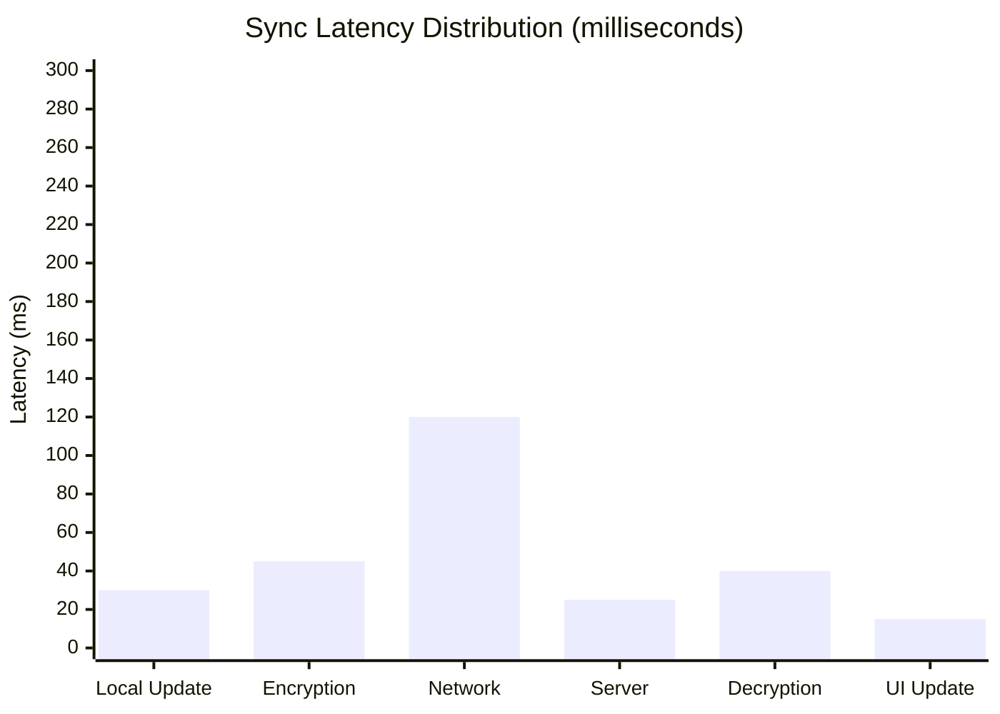

# Performance Benchmarks

## Test Environment

| Component | Specification |
|-----------|---------------|
| Server | 4 vCPU, 8GB RAM |
| Storage | Redis 7.x |
| Network | 1Gbps LAN |
| Client | Chrome 120, M1 MacBook |

## Sync Latency

### End-to-End Latency Distribution



### P50/P95/P99 Latency

| Operation | P50 | P95 | P99 |
|-----------|-----|-----|-----|
| Local update | 30ms | 45ms | 60ms |
| Encryption (1MB) | 45ms | 80ms | 120ms |
| Network RTT | 120ms | 200ms | 350ms |
| Full sync | 200ms | 350ms | 500ms |

## Throughput

### Single Server Performance

| Metric | Value |
|--------|-------|
| Concurrent connections | 10,000+ |
| Message throughput | 5,000 msg/s |
| Data throughput | 50 MB/s |

### Stress Test Results

```bash
# Using artillery for stress testing
artillery quick --count 100 --num 10 ws://localhost:3002

# Sample Results
# Scenarios launched:  1000
# Scenarios completed: 1000
# Requests completed: 50000
# Mean latency: 45ms
# P99 latency: 120ms
```

## Storage Performance

### IndexedDB Operation Latency

| Operation | Content Size | Latency |
|-----------|--------------|---------|
| Write | 1KB | 2ms |
| Write | 100KB | 8ms |
| Write | 1MB | 45ms |
| Read | 1KB | 1ms |
| Read | 100KB | 5ms |
| Read | 1MB | 30ms |

### Redis Performance

| Operation | Latency |
|-----------|---------|
| SET | 0.5ms |
| GET | 0.3ms |
| HSET | 0.4ms |
| HGET | 0.3ms |

## Encryption Performance

### Key Derivation (PBKDF2)

```javascript
// 100,000 iterations
console.time('PBKDF2');
await crypto.subtle.deriveKey(/* ... */);
console.timeEnd('PBKDF2');
// Output: PBKDF2: 85ms
```

### AES-GCM Encryption/Decryption

| Content Size | Encrypt | Decrypt |
|--------------|---------|---------|
| 1KB | 1ms | 1ms |
| 10KB | 2ms | 2ms |
| 100KB | 8ms | 7ms |
| 1MB | 45ms | 40ms |
| 5MB | 180ms | 160ms |

## Memory Usage

### Client

| Component | Memory Usage |
|-----------|--------------|
| React App | 25MB |
| IndexedDB cache | 10-50MB |
| Encryption operations | 5MB |
| **Total** | 40-80MB |

### Server

| Component | Memory Usage |
|-----------|--------------|
| Node.js base | 30MB |
| Socket.IO | 20MB |
| Per-connection overhead | ~10KB |
| Redis client | 5MB |

## Network Efficiency

### Payload Overhead

| Content Type | Original | Transmitted | Overhead |
|--------------|----------|-------------|----------|
| Text (UTF-8) | 1KB | 1.4KB | 40% |
| Text (encrypted) | 1KB | 1.8KB | 80% |
| Binary | 1KB | 1.4KB | 40% |

### Compression Effect

| Content | Uncompressed | Gzip | Brotli |
|---------|--------------|------|--------|
| Markdown | 100KB | 25KB | 18KB |
| JSON | 100KB | 15KB | 12KB |
| Code | 100KB | 20KB | 15KB |

## Optimization Recommendations

### 1. Large File Optimization

```javascript
// Use chunked transfer
const CHUNK_SIZE = 100 * 1024; // 100KB
// Consider compression
const compressed = await compress(content);
```

### 2. Frequent Edit Optimization

```javascript
// Increase debounce time
const DEBOUNCE_TIME = 500; // Increase from 300ms to 500ms
```

### 3. Server Optimization

```javascript
// Enable Redis cluster
const redis = new Redis.Cluster([
  { host: 'redis-1', port: 6379 },
  { host: 'redis-2', port: 6379 },
  { host: 'redis-3', port: 6379 }
]);
```

### 4. Client Optimization

```javascript
// Limit version history
const MAX_VERSIONS = 10;

// Use Web Workers for encryption
const worker = new Worker('encryption-worker.js');
```

## Scalability Limits

### Single Server Limits

| Resource | Limit | Mitigation |
|----------|-------|------------|
| Connections | ~50,000 | Horizontal scaling |
| Rooms | ~10,000 | LRU eviction |
| Memory | ~2GB effective | Redis external |

### Recommended Deployment

| Users | Deployment |
|-------|------------|
| < 100 | Single container |
| 100-1000 | 2 instances + Redis |
| 1000+ | Kubernetes + Redis Cluster |

## Benchmark Scripts

### Client Performance

```javascript
// Benchmark encryption
async function benchmarkEncryption() {
  const content = 'x'.repeat(1024 * 1024); // 1MB
  const start = performance.now();
  
  for (let i = 0; i < 10; i++) {
    await encrypt(content, key, roomId);
  }
  
  const elapsed = performance.now() - start;
  console.log(`Average: ${elapsed / 10}ms`);
}
```

### Server Performance

```bash
# Using wrk for HTTP benchmarking
wrk -t4 -c100 -d30s http://localhost:3002/health

# Using artillery for WebSocket
artillery run benchmark.yaml
```

---

These benchmarks are based on v2.2.0. Results may vary depending on hardware and network conditions.
