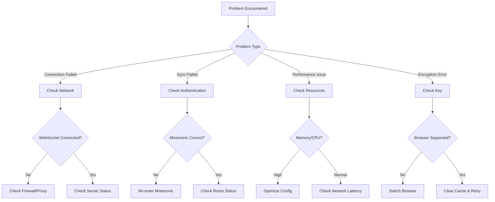

# Troubleshooting Guide

## Quick Diagnosis Flowchart



## Connection Issues

### Symptom: Cannot Connect to Sync Server

**Diagnostic Steps:**

1. **Check WebSocket Connection**
```javascript
// Run in browser console
const ws = new WebSocket('ws://your-server:3002');
ws.onopen = () => console.log('✅ Connection successful');
ws.onerror = (e) => console.error('❌ Connection failed', e);
```

2. **Check Firewall Rules**
```bash
# Run on server
sudo ufw status
# Ensure port 3002 is open
sudo ufw allow 3002/tcp
```

3. **Check Server Logs**
```bash
docker logs note-sync-server
# Look for error messages
```

**Solutions:**

| Cause | Solution |
|-------|----------|
| Firewall blocking | Open corresponding port |
| Proxy configuration | Configure WebSocket proxy |
| SSL certificate | Ensure certificate is valid |
| Service not started | Restart service |

### Symptom: Frequent Disconnections

**Possible Causes:**

1. **Network instability**
   - Try wired connection
   - Switch to stable network

2. **Server resource exhaustion**
   - Check server memory usage
   - Scale horizontally

3. **Client browser throttling**
   - Disable power saving mode
   - Keep tab active

## Sync Issues

### Symptom: Content Not Syncing

**Diagnostic Checklist:**

- [ ] Check network connection
- [ ] Confirm same room
- [ ] Verify mnemonic consistency
- [ ] Check browser console errors

**Browser Console Debugging:**
```javascript
// Check Socket status
console.log(window.__SOCKET__);

// Manually trigger sync
window.__SOCKET__.emit('request-sync', { roomId: 'your-room-id' });
```

### Symptom: Conflict Markers Appear

**Explanation:**
```
<<<<<<< LOCAL
Local modified content
=======
Remote modified content
>>>>>>> REMOTE
```

**Resolution Steps:**
1. Manually select content to keep
2. Delete conflict marker symbols
3. Save and it will auto-sync

### Symptom: Sync Delay Too Long

**Performance Baseline:**

| Operation | Normal | Abnormal |
|-----------|--------|----------|
| Local update | < 50ms | > 200ms |
| Encryption | < 100ms | > 500ms |
| Network RTT | < 200ms | > 1s |

**Optimization Suggestions:**

1. **Reduce debounce time** (if too long)
```javascript
// Default is 300ms, adjust as needed
const DEBOUNCE_TIME = 200;
```

2. **Enable compression** (server-side)
```javascript
// apps/api/index.js
app.use(compression());
```

## Encryption Issues

### Symptom: Decryption Failed

**Common Causes:**

| Error Message | Cause | Solution |
|---------------|-------|----------|
| `OperationError` | Key mismatch | Confirm mnemonic is correct |
| `Invalid IV` | Data corruption | Clear cache and retry |
| `Authentication failed` | Data tampered | Check network integrity |

**Debug Method:**
```javascript
// Verify key derivation
const mnemonic = 'your twelve word mnemonic phrase here';
const roomId = deriveRoomId(mnemonic);
console.log('Room ID:', roomId); // Should be 32-char hex
```

### Symptom: Key Derivation Slow

**Normal Time:**

| Operation | Normal Time |
|-----------|-------------|
| Mnemonic to seed | < 10ms |
| PBKDF2 100k iterations | 80-150ms |
| Total key derivation | < 200ms |

**If significantly slower:**

1. Check CPU usage
2. Close unnecessary tabs
3. Use modern browser

## Performance Issues

### Symptom: High Memory Usage

**Normal Memory Usage:**

| Component | Memory |
|-----------|--------|
| React App | 25MB |
| IndexedDB cache | 10-50MB |
| Encryption operations | 5MB |
| **Total** | 40-80MB |

**If significantly higher:**

1. **Clear old versions**
```javascript
// Clear old note history
await clearOldVersions(MAX_VERSIONS = 10);
```

2. **Limit room count**
```javascript
// Server config
const MAX_ROOMS = 1000;
```

### Symptom: Slow IndexedDB Operations

**Performance Baseline:**

| Operation | Size | Normal Time |
|-----------|------|-------------|
| Write | 1KB | 2ms |
| Write | 100KB | 8ms |
| Write | 1MB | 45ms |
| Read | 1KB | 1ms |
| Read | 100KB | 5ms |
| Read | 1MB | 30ms |

**Optimization:**

1. **Clean up regularly**
```javascript
// Clear data older than 30 days
await cleanOldData(30);
```

2. **Use indexes**
```javascript
// Ensure indexes are created
createIndexes();
```

## Server Issues

### Symptom: High CPU Usage

**Diagnostic:**

```bash
# Check process
top -p $(pgrep -f "node.*index.js")

# Check connection count
netstat -an | grep 3002 | wc -l
```

**Solutions:**

1. **Scale horizontally** - Add more instances
2. **Optimize config** - Reduce max connections
3. **Enable caching** - Use Redis

### Symptom: Persistence Errors

**Redis Connection Issues:**

```bash
# Check Redis status
redis-cli ping
# Should return PONG

# Check memory
redis-cli info memory
```

**SQLite Issues:**

```bash
# Check file permissions
ls -la data/sync.db

# Check disk space
df -h
```

## Log Collection

### Enable Debug Mode

```javascript
// Client
localStorage.setItem('DEBUG', 'note-sync:*');

// Server
DEBUG=note-sync:* node apps/api/index.js
```

### Collect Diagnostic Info

```bash
# One-click collection
curl http://your-server:3002/health > health.json
curl http://your-server:3002/stats > stats.json
docker logs note-sync-server > server.log 2>&1
```

### Common Log Patterns

| Pattern | Issue | Action |
|---------|-------|--------|
| `ECONNREFUSED` | Service not started | Start service |
| `ETIMEDOUT` | Network timeout | Check network |
| `ENOMEM` | Out of memory | Increase memory |
| `Rate limited` | Request too frequent | Reduce frequency |

---

Still having issues? [Submit an Issue](https://github.com/AICL-Lab/brave-sync-notes/issues) with:
- Error messages
- Browser and version
- Steps to reproduce
