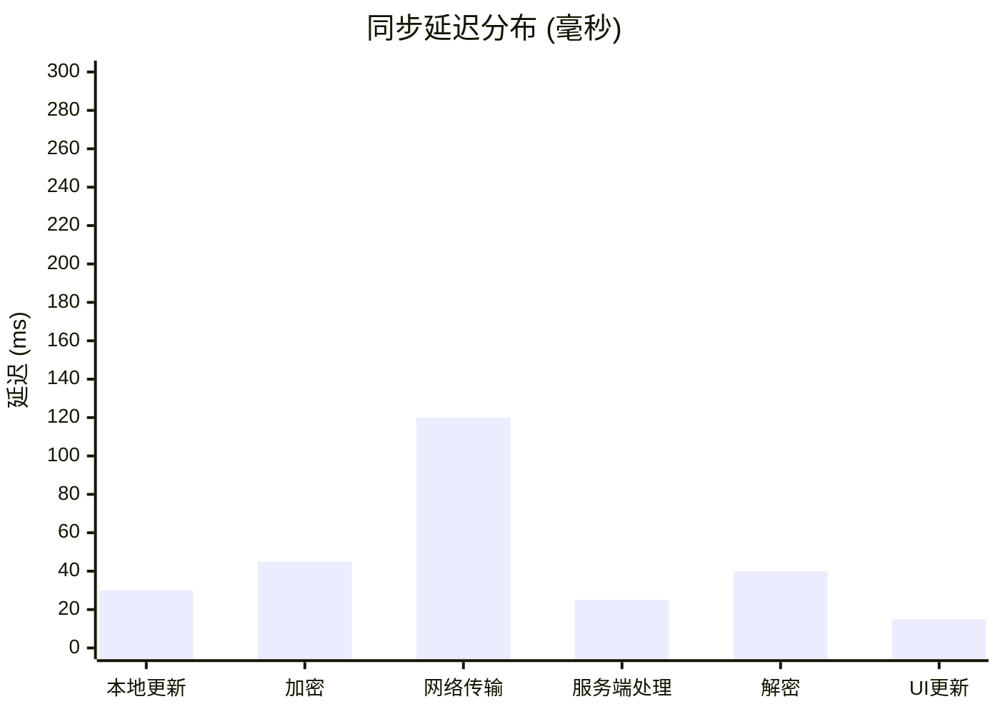

# 性能基准

## 测试环境

| 配置项 | 规格 |
|--------|------|
| 服务端 | 4 vCPU, 8GB RAM |
| 存储 | Redis 7.x |
| 网络 | 1Gbps 内网 |
| 客户端 | Chrome 120, M1 MacBook |

## 同步延迟

### 端到端延迟分布



### P50/P95/P99 延迟

| 操作 | P50 | P95 | P99 |
|------|-----|-----|-----|
| 本地更新 | 30ms | 45ms | 60ms |
| 加密 (1MB) | 45ms | 80ms | 120ms |
| 网络往返 | 120ms | 200ms | 350ms |
| 完整同步 | 200ms | 350ms | 500ms |

## 吞吐量

### 单服务端性能

| 指标 | 数值 |
|------|------|
| 并发连接 | 10,000+ |
| 消息吞吐 | 5,000 msg/s |
| 数据吞吐 | 50 MB/s |

### 压力测试结果

```bash
# 使用 artillery 进行压力测试
artillery quick --count 100 --num 10 ws://localhost:3002

# 结果示例
# Scenarios launched:  1000
# Scenarios completed: 1000
# Requests completed: 50000
# Mean latency: 45ms
# P99 latency: 120ms
```

## 存储性能

### IndexedDB 操作延迟

| 操作 | 内容大小 | 延迟 |
|------|---------|------|
| 写入 | 1KB | 2ms |
| 写入 | 100KB | 8ms |
| 写入 | 1MB | 45ms |
| 读取 | 1KB | 1ms |
| 读取 | 100KB | 5ms |
| 读取 | 1MB | 30ms |

### Redis 性能

| 操作 | 延迟 |
|------|------|
| SET | 0.5ms |
| GET | 0.3ms |
| HSET | 0.4ms |
| HGET | 0.3ms |

## 加密性能

### 密钥派生 (PBKDF2)

```javascript
// 100,000 次迭代
console.time('PBKDF2');
await crypto.subtle.deriveKey(/* ... */);
console.timeEnd('PBKDF2');
// 输出: PBKDF2: 85ms
```

### AES-GCM 加密/解密

| 内容大小 | 加密 | 解密 |
|---------|------|------|
| 1KB | 1ms | 1ms |
| 10KB | 2ms | 2ms |
| 100KB | 8ms | 7ms |
| 1MB | 45ms | 40ms |
| 5MB | 180ms | 160ms |

## 内存占用

### 客户端

| 组件 | 内存占用 |
|------|---------|
| React App | 25MB |
| IndexedDB 缓存 | 10-50MB |
| 加密操作 | 5MB |
| **总计** | 40-80MB |

### 服务端

| 组件 | 内存占用 |
|------|---------|
| Node.js 基础 | 30MB |
| Socket.IO | 20MB |
| 每连接开销 | ~10KB |
| Redis 客户端 | 5MB |

## 网络效率

### 负载开销

| 内容类型 | 原始大小 | 传输大小 | 开销 |
|---------|---------|---------|------|
| 文本 (UTF-8) | 1KB | 1.4KB | 40% |
| 文本 (加密后) | 1KB | 1.8KB | 80% |
| 二进制 | 1KB | 1.4KB | 40% |

### 压缩效果

| 内容 | 未压缩 | Gzip | Brotli |
|------|--------|------|--------|
| Markdown | 100KB | 25KB | 18KB |
| JSON | 100KB | 15KB | 12KB |
| 代码 | 100KB | 20KB | 15KB |

## 优化建议

### 1. 大文件优化

```javascript
// 使用分块传输
const CHUNK_SIZE = 100 * 1024; // 100KB
// 考虑压缩
const compressed = await compress(content);
```

### 2. 频繁编辑优化

```javascript
// 增加防抖时间
const DEBOUNCE_TIME = 500; // 从 300ms 增加到 500ms
```

### 3. 服务端优化

```javascript
// 启用 Redis 集群
const redis = new Redis.Cluster([
  { host: 'redis-1', port: 6379 },
  { host: 'redis-2', port: 6379 },
  { host: 'redis-3', port: 6379 }
]);
```

### 4. 客户端优化

```javascript
// 限制历史版本
const MAX_VERSIONS = 10;

// 使用 Web Worker 进行加密
const worker = new Worker('encryption-worker.js');
```

## 扩展性限制

### 单服务端限制

| 资源 | 限制 | 缓解措施 |
|------|------|---------|
| 连接数 | ~50,000 | 水平扩展 |
| 房间数 | ~10,000 | LRU 淘汰 |
| 内存 | ~2GB 有效 | Redis 外置 |

### 推荐部署方案

| 用户数 | 部署方案 |
|--------|---------|
| < 100 | 单容器 |
| 100-1000 | 2 实例 + Redis |
| 1000+ | Kubernetes + Redis Cluster |

## 基准测试脚本

### 客户端性能

```javascript
// 基准加密性能
async function benchmarkEncryption() {
  const content = 'x'.repeat(1024 * 1024); // 1MB
  const start = performance.now();
  
  for (let i = 0; i < 10; i++) {
    await encrypt(content, key, roomId);
  }
  
  const elapsed = performance.now() - start;
  console.log(`平均耗时: ${elapsed / 10}ms`);
}
```

### 服务端性能

```bash
# 使用 wrk 进行 HTTP 基准测试
wrk -t4 -c100 -d30s http://localhost:3002/health

# 使用 artillery 进行 WebSocket 测试
artillery run benchmark.yaml
```

---

这些基准数据基于 v2.2.0 版本。实际结果可能因硬件和网络条件而异。
