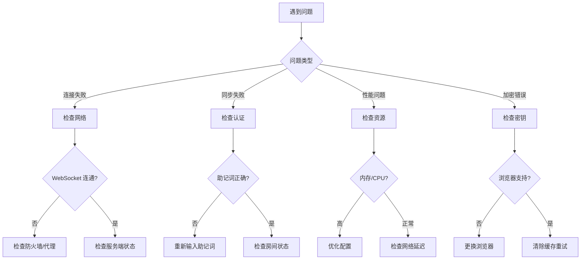

# 故障排查指南

## 快速诊断流程



## 连接问题

### 症状: 无法连接到同步服务器

**诊断步骤：**

1. **检查 WebSocket 连接**
```javascript
// 浏览器控制台执行
const ws = new WebSocket('ws://your-server:3002');
ws.onopen = () => console.log('✅ 连接成功');
ws.onerror = (e) => console.error('❌ 连接失败', e);
```

2. **检查防火墙规则**
```bash
# 服务端执行
sudo ufw status
# 确保 3002 端口开放
sudo ufw allow 3002/tcp
```

3. **检查服务端日志**
```bash
docker logs note-sync-server
# 查找错误信息
```

**解决方案：**

| 原因 | 解决方法 |
|------|---------|
| 防火墙阻断 | 开放对应端口 |
| 代理配置 | 配置 WebSocket 代理 |
| SSL 证书 | 确保证书有效 |
| 服务未启动 | 重启服务 |

### 症状: 频繁断开连接

**可能原因：**

1. **网络不稳定**
   - 尝试有线连接
   - 切换到稳定网络

2. **服务端资源耗尽**
   - 检查服务端内存使用
   - 水平扩容

3. **客户端浏览器节流**
   - 关闭省电模式
   - 保持标签页活跃

## 同步问题

### 症状: 内容不同步

**诊断清单：**

- [ ] 检查网络连接
- [ ] 确认在同一房间
- [ ] 验证助记词一致
- [ ] 查看浏览器控制台错误

**浏览器控制台调试：**
```javascript
// 查看 Socket 状态
console.log(window.__SOCKET__);

// 手动触发同步
window.__SOCKET__.emit('request-sync', { roomId: 'your-room-id' });
```

### 症状: 出现冲突标记

**解释：**
```
<<<<<<< LOCAL
本地修改内容
=======
远端修改内容
>>>>>>> REMOTE
```

**解决方法：**
1. 手动选择保留的内容
2. 删除冲突标记符号
3. 保存后自动同步

### 症状: 同步延迟过长

**性能基准：**

| 操作 | 正常耗时 | 异常阈值 |
|------|---------|---------|
| 本地更新 | < 50ms | > 200ms |
| 加密 | < 100ms | > 500ms |
| 网络往返 | < 200ms | > 1s |

**优化建议：**

1. **减少防抖时间**（如果过长）
```javascript
// 默认 300ms，按需调整
const DEBOUNCE_TIME = 200;
```

2. **启用压缩**（服务端）
```javascript
// apps/api/index.js
app.use(compression());
```

## 加密问题

### 症状: 解密失败

**常见原因：**

| 错误信息 | 原因 | 解决方法 |
|---------|------|---------|
| `OperationError` | 密钥不匹配 | 确认助记词正确 |
| `Invalid IV` | 数据损坏 | 清除缓存重试 |
| `Authentication failed` | 数据被篡改 | 检查网络完整性 |

**调试方法：**
```javascript
// 验证密钥派生
const mnemonic = 'your twelve word mnemonic phrase here';
const roomId = deriveRoomId(mnemonic);
console.log('Room ID:', roomId); // 应为 32 字符十六进制
```

### 症状: 密钥派生缓慢

**正常时间：**

| 操作 | 正常时间 |
|------|---------|
| 助记词转种子 | < 10ms |
| PBKDF2 100k 迭代 | 80-150ms |
| 完整密钥派生 | < 200ms |

**如果显著变慢：**

1. 检查 CPU 使用率
2. 关闭不必要的标签页
3. 使用现代浏览器

## 性能问题

### 症状: 内存占用过高

**正常内存占用：**

| 组件 | 内存占用 |
|------|---------|
| React App | 25MB |
| IndexedDB 缓存 | 10-50MB |
| 加密操作 | 5MB |
| **总计** | 40-80MB |

**如果显著高于此：**

1. **清理旧版本**
```javascript
// 清理旧笔记历史
await clearOldVersions(MAX_VERSIONS = 10);
```

2. **限制房间数量**
```javascript
// 服务端配置
const MAX_ROOMS = 1000;
```

### 症状: IndexedDB 操作缓慢

**性能基准：**

| 操作 | 大小 | 正常耗时 |
|------|------|---------|
| 写入 | 1KB | 2ms |
| 写入 | 100KB | 8ms |
| 写入 | 1MB | 45ms |
| 读取 | 1KB | 1ms |
| 读取 | 100KB | 5ms |
| 读取 | 1MB | 30ms |

**优化：**

1. **定期清理**
```javascript
// 清除 30 天前的数据
await cleanOldData(30);
```

2. **使用索引**
```javascript
// 确保索引已创建
createIndexes();
```

## 服务端问题

### 症状: CPU 使用率过高

**诊断：**

```bash
# 查看进程
top -p $(pgrep -f "node.*index.js")

# 查看连接数
netstat -an | grep 3002 | wc -l
```

**解决方案：**

1. **水平扩展** - 增加实例数
2. **优化配置** - 减少最大连接数
3. **启用缓存** - 使用 Redis

### 症状: 持久化错误

**Redis 连接问题：**

```bash
# 检查 Redis 状态
redis-cli ping
# 应返回 PONG

# 检查内存
redis-cli info memory
```

**SQLite 问题：**

```bash
# 检查文件权限
ls -la data/sync.db

# 检查磁盘空间
df -h
```

## 日志收集

### 启用调试模式

```javascript
// 客户端
localStorage.setItem('DEBUG', 'note-sync:*');

// 服务端
DEBUG=note-sync:* node apps/api/index.js
```

### 收集诊断信息

```bash
# 一键收集
curl http://your-server:3002/health > health.json
curl http://your-server:3002/stats > stats.json
docker logs note-sync-server > server.log 2>&1
```

### 常见日志模式

| 模式 | 问题 | 操作 |
|------|------|------|
| `ECONNREFUSED` | 服务未启动 | 启动服务 |
| `ETIMEDOUT` | 网络超时 | 检查网络 |
| `ENOMEM` | 内存不足 | 增加内存 |
| `Rate limited` | 请求过频 | 降低频率 |

---

仍然无法解决？[提交 Issue](https://github.com/AICL-Lab/brave-sync-notes/issues) 并附上：
- 错误信息
- 浏览器和版本
- 重现步骤
